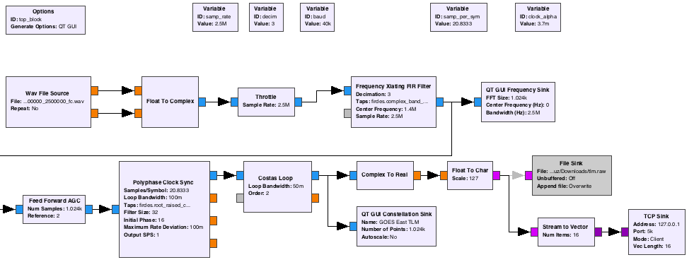

GOES-16 CDA Telemetry Demodulator
=========================================

The telemetry signal from GOES-16 is centered in 1963 MHz close to the HRIT Signal (1964.1 MHz). Since there is no Convolutional Error correction you will need a good SNR to be decodable. Decimating the signal will help improve the SNR. You can download a sample I/Q recoding [here](http://www.teske.net.br/lucas/basebands/goes16/HRIT/gqrx_20170124_060211_1694100000_2500000_fc.wav).

  

The demodulator is made with [GNURadio](https://github.com/gnuradio/gnuradio) Companion.
